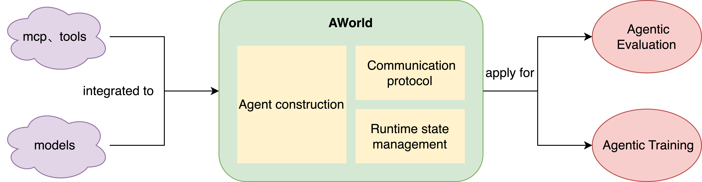

<div align="center">


# AWorld: Advancing Agentic AI

[](https://x.com/InclusionAI666)
[](https://raw.githubusercontent.com/inclusionAI/AWorld/main/readme_assets/aworld_wechat_qr.jpg)
[](https://discord.gg/b4Asj2ynMw)
[](https://opensource.org/licenses/MIT)

</div>

## News
- 🐳 [2024/05/22] For quick GAIA evaluation, MCP tools, AWorld, and models are now available in a single Docker image. See <code>./README-docker.md</code> for instructions and [youtube video](https://www.youtube.com/watch?v=kkYWeVvJKrg) for demo.
- 🥳 [2024/05/13] AWorld has updated its state management for browser use and enhanced the video processing MCP server, achieving a score of 77.58 on GAIA validation (Pass@1 = 61.8) and maintaining its position as the top-ranked open-source framework. Learn more: [GAIA leaderboard](https://huggingface.co/spaces/gaia-benchmark/leaderboard)
- ✨ [2025/04/23] AWorld ranks 3rd on GAIA benchmark (69.7 avg) with impressive Pass@1 = 58.8, 1st among open-source frameworks. Reproduce with <code>python examples/gaia/run.py</code>


## Introduction

AWorld (short for Agent World) is an advanced framework where multiple AI agents collaborate to accomplish complex goals, such as those found in the GAIA benchmark. Its core features include:

- **Collaboration**: Enables event-driven communication on two hierarchical levels—between agents, and between models and environments (e.g., MCP servers).
- **Autonomy**: Features robust runtime state management for handling multi-step, intricate tasks.
- **Evolution**: Supports a highly concurrent execution environment, empowering agents to learn and adapt across diverse tasks and environments.

Unlock the power of intelligent teamwork and continuous improvement with AWorld!

## What we offer:
For quick evaluation, training, rapid prototyping, and other use cases, we provide Docker images that package the MCP tools, AWorld framework, and models together. This enables users to effortlessly utilize AWorld’s communication protocols and state management features right out of the box. The available Docker images are listed below:

<table>
  <tr>
    <th>Scenario</th>
    <th>Docker</th>
    <th>Demo</th>
  </tr>
  <tr>
    <td rowspan="1">Evalution</td>
    <td>GAIA Evaluation Docker Image. For instructions on building the image, see <code>./README-docker.md</code>.</td>
   <td>
      <a href="https://www.youtube.com/watch?v=kkYWeVvJKrg" target="_blank">
        
        <br>
        <p align="left">▶️ Runing GAIA task in our image</p>
      </a>
   </td>
  </tr>

  <tr>
    <td rowspan="1">Training</td>
    <td>  GAIA Training Docker Images, supporting distributed and  high-concurrency deployments. Instructions for training are <i>coming soon</i>.
</td>
    <td></td>
  </tr>
</table>

> **Want to build your own multi-agent system? Check out the detailed tutorials below to get started! ⬇️⬇️⬇️** 

## Installation
With Python>=3.11:
```bash
pip install aworld
```

## Usage
### Quick Start
```python
from aworld.config.conf import AgentConfig
from aworld.core.agent.base import Agent
from aworld.runner import Runners

if __name__ == '__main__':
    agent_config = AgentConfig(
        llm_provider="openai",
        llm_model_name="gpt-4o",

        # Set via environment variable or direct configuration
        # llm_api_key="YOUR_API_KEY", 
        # llm_base_url="https://api.openai.com/v1"
    )

    search = Agent(
        conf=agent_config,
        name="search_agent",
        system_prompt="You are a helpful agent.",
        mcp_servers=["amap-amap-sse"] # MCP server name for agent to use
    )

    # Run agent
    Runners.sync_run(input="Hotels within 1 kilometer of West Lake in Hangzhou",
                     agent=search)
```
Here is a MCP server config [example.](examples/mcp_demo/mcp_example.json)


### Running Pre-defined Agents ([demo code](examples/browsers/run.py))
Below are demonstration videos showcasing AWorld's capabilities across different agent configurations and environments.

<table>
  <tr>
    <th>Mode</th>
    <th>Type</th>
    <th>Demo</th>
  </tr>
  <tr>
    <td rowspan="2">Single Agent</td>
    <td>Browser use</td>
    <td>
      <a href="https://www.youtube.com/watch?v=R7keOLrRDoM" target="_blank">
        
        <br>
        <p align="center">▶️ Watch Browser Demo on YouTube</p>
      </a>
    </td>
  </tr>
  <tr>
    <td>Phone use</td>
    <td>
      <a href="https://www.youtube.com/watch?v=TYh3iqDeIoQ" target="_blank">
        
        <br>
        <p align="center">▶️ Watch Mobile Demo on YouTube</p>
      </a>
    </td>
  </tr>
  <tr>
    <td rowspan="3">Multi Agent</td>
    <td>Cooperative Teams</td>
    <td>
       <a href="https://www.youtube.com/watch?v=sEsgasRrlTs" target="_blank">
        
        <br>
        <p align="center">▶️ Watch Travel Demo on YouTube</p>
      </a>
    </td>
  </tr>
  <tr>
    <td>Competitive Teams</td>
     <td>
       <a href="https://www.youtube.com/watch?v=_CPdhoP4YTg" target="_blank">
        
        <br>
        <p align="center">▶️ Watch Debate Arena on YouTube</p>
      </a>
    </td>
  </tr>
  <tr>
    <td>Mixed of both Teams</td>
    <td align="center"><i>Coming Soon</i> 🚀</td>
  </tr>
</table>

### or Creating Your Own Agents ([Quick Start Tutorial](./aworld/agents/README.md))
Here is a multi-agent example of running a level2 task from the [GAIA](https://huggingface.co/gaia-benchmark) benchmark:

```python
from examples.plan_execute.agent import PlanAgent, ExecuteAgent
from examples.tools.common import Agents, Tools
from aworld.core.agent.swarm import Swarm
from aworld.core.task import Task
from aworld.config.conf import AgentConfig, TaskConfig
from aworld.dataset.mock import mock_dataset
from aworld.runner import Runners

import os

# Need OPENAI_API_KEY
os.environ['OPENAI_API_KEY'] = "your key"
# Optional endpoint settings, default `https://api.openai.com/v1`
# os.environ['OPENAI_ENDPOINT'] = "https://api.openai.com/v1"

# One sample for example
test_sample = mock_dataset("gaia")

# Create agents
plan_config = AgentConfig(
    name=Agents.PLAN.value,
    llm_provider="openai",
    llm_model_name="gpt-4o",
)
agent1 = PlanAgent(conf=plan_config)

exec_config = AgentConfig(
    name=Agents.EXECUTE.value,
    llm_provider="openai",
    llm_model_name="gpt-4o",
)
agent2 = ExecuteAgent(conf=exec_config, tool_names=[Tools.DOCUMENT_ANALYSIS.value])

# Create swarm for multi-agents
# define (head_node, tail_node) edge in the topology graph
# NOTE: the correct order is necessary
swarm = Swarm((agent1, agent2), sequence=False)

# Define a task
task = Task(input=test_sample, swarm=swarm, conf=TaskConfig())

# Run task
result = Runners.sync_run_task(task=task)

print(f"Time cost: {result['time_cost']}")
print(f"Task Answer: {result['task_0']['answer']}")
```
```
Time cost: 26.431413888931274
Task Answer: Time-Parking 2: Parallel Universe
```
<p align="left">
  <video src="https://github.com/user-attachments/assets/84ccf675-08df-47c1-bd0e-416480ad7cff" controls="controls" muted="muted" style="width: 45%;"></video>
</p>

## Framework Architecture

AWorld uses a client-server architecture with three main components:

1. **Client-Server Architecture**: Similar to [ray](https://github.com/ray-project/ray), this architecture:
    - Decouples agents and environments for better scalability and flexibility
    - Provides a unified interaction protocol for all agent-environment interactions

2. **Agent/Actor**: 
   - Encapsulates system prompts, tools, mcp servers, and models with the capability to hand off execution to other agents

    | Field        | Type      | Description                                                           |
    |--------------|-----------|-----------------------------------------------------------------------|
    | `id`         | string    | Unique identifier for the agent                                       |
    | `name`       | string    | Name of the agent                                                     |
    | `model_name` | string    | LLM model name of the agent                                           |
    | `_llm`       | object    | LLM model instance based on model_name (e.g., "gpt-4", "claude-3")    |
    | `conf`       | BaseModel | Configuration inheriting from pydantic BaseModel                      |
    | `trajectory`     | object    | Memory for maintaining context across interactions                   |
    | `tool_names` | list      | List of tools the agent can use                                       |
    | `mcp_servers` | list      | List of mcp servers the agent can use                                       |
    | `handoffs`   | list      | Agent as tool; list of other agents the agent can delegate tasks to                 |
    | `finished`   | bool      | Flag indicating whether the agent has completed its task              |

3. **Environment/World Model**: Various tools and models in the environment
   - MCP servers
   - Computer interfaces (browser, shell, functions, etc.)
   - World Model

   | Tools | Description |
   |-------|-------------|
   | `mcp Servers` | AWorld seamlessly integrates a rich collection of MCP servers as agent tools|
   | `browser` | Controls web browsers for navigation, form filling, and interaction with web pages |
   | `android` | Manages Android device simulation for mobile app testing and automation |
   | `shell` | Executes shell commands for file operations and system interactions |
   | `code` | Runs code snippets in various languages for data processing and automation |
   | `search` | Performs web searches and returns structured results for information gathering and summary |
   | `document` | Handles file operations including reading, writing, and managing directories |


## Dual Purpose Framework

AWorld serves two complementary purposes:

### Agent Evaluation
- Unified task definitions to run both customized and public benchmarks
- Efficient and stable execution environment
- Detailed test reports measuring efficiency (steps to completion), completion rates, token costs, ect.

### Agent Training
- Agent models improve to overcome challenges from env
- World models (environments) evolve to present new, more complex scenarios

## 🔧 Key Features

- ✨ **MCP Servers as Tools** - Powerful integration of MCP servers providing robust tooling capabilities
- 🌐 **Environment Multi-Tool Support**: 
  - [x] Default computer-use tools; (browser, shell, code, APIs, file system, etc.)
  - [x] Android device simulation
  - [ ] Cloud sandbox for quick and stable deployment
  - [ ] Reward model as env simulation

- 🤖 **AI-Powered Agents**:
  - [x] Agent initialization
  - [x] Delegation between multiple agents
  - [ ] Asynchronous delegation
  - [ ] Human delegation (e.g., for password entry)
  - [ ] Pre-deployed open source LLMs powered by state-of-the-art [inference frameworks](https://github.com/alipay/PainlessInferenceAcceleration)

- 🎛️ **Web Interface**:
  - [ ] UI for execution visualization
  - [ ] Server configuration dashboard
  - [ ] Real-time monitoring tools
  - [ ] Performance reporting

- 🧠 **Benchmarks and Samples**:
  - [ ] Support standardized benchmarks by default, e.g., GAIA, WebArena
  - [ ] Support customized benchmarks
  - [ ] Support generating training samples

## Contributing
We warmly welcome developers to join us in building and improving AWorld! Whether you're interested in enhancing the framework, fixing bugs, or adding new features, your contributions are valuable to us.

For academic citations or wish to contact us, please use the following BibTeX entry:

```bibtex
@software{aworld2025,
  author = {Agent Team at Ant Group},
  title = {AWorld: A Unified Agent Playground for Computer and Phone Use Tasks},
  year = {2025},
  url = {https://github.com/inclusionAI/AWorld},
  version = {0.1.0},
  publisher = {GitHub},
  email = {chenyi.zcy at antgroup.com}
}
```

## License

This project is licensed under the MIT License - see the [LICENSE](LICENSE) file for details.