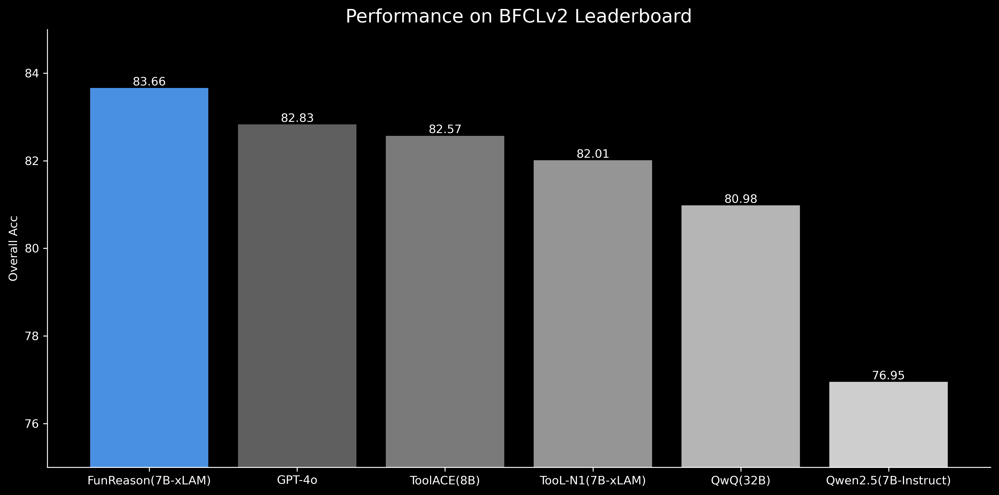
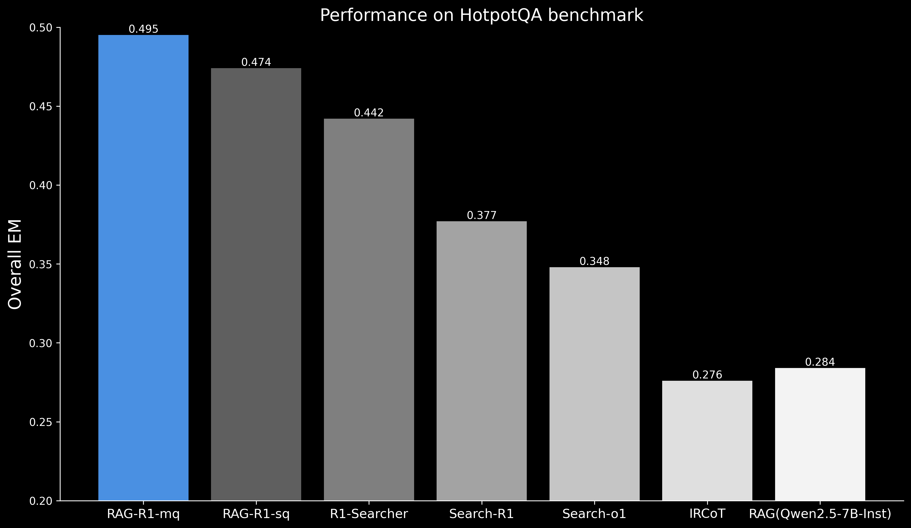
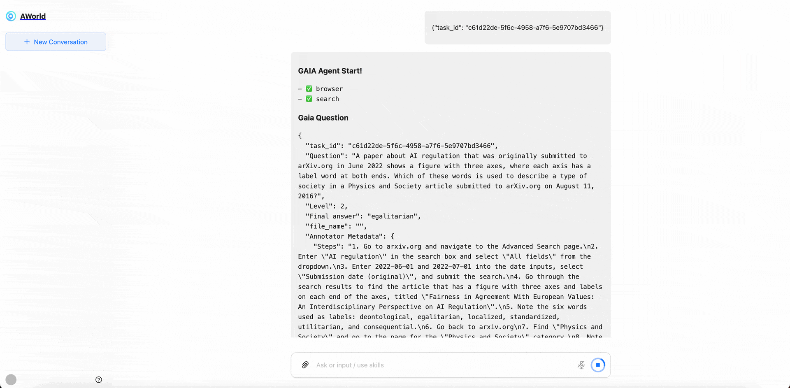
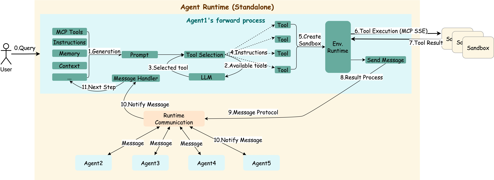
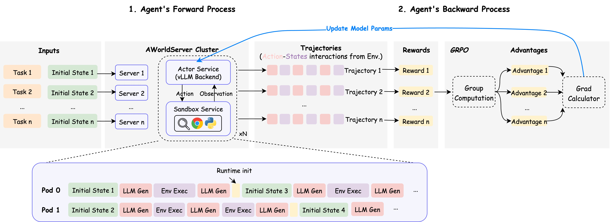

<div align="left">

# AWorld：为智能体自我演进提供运行环境
*"自我认知：最难的问题不是在有局限的情况下解决问题，而是发现自己的局限性"*

[](https://x.com/InclusionAI666)
[](https://raw.githubusercontent.com/inclusionAI/AWorld/main/readme_assets/aworld_wechat_qr.jpg)
[](https://discord.gg/b4Asj2ynMw)
[](https://opensource.org/licenses/MIT)
[](https://deepwiki.com/inclusionAI/AWorld)
<!-- [](https://arxiv.org/abs/xxxx.xxxxx) -->

</div>

## 目录
- [最新动态](#最新动态) — 项目最新更新与公告。
- [简介](#简介) — 项目概述与目标。
- [安装](#安装) — 步骤详尽的安装指南。
- [快速开始](#快速开始) — 使用示例，快速上手。
- [架构](#架构) — 多智能体系统设计解析。
- [演示](#演示) — 项目实际运行演示。
- [贡献](#贡献) — 如何参与和贡献代码。
- [许可证](#许可证) — 项目授权信息。

## 最新动态
- 🐱 [2025/07/25] AWorld实现快速数学推理！仅用几小时就构建了多智能体系统，解决了IMO 2025中5/6的题目。查看[IMO](examples/imo/README.md)部分的实现。
- 🦍 [2025/07/23] 我们发布了BFCL基准测试的运行时构建教程！学习如何在我们的综合[`教程`](examples/BFCL/README.md)中合成函数调用样本。
- 🦤 [2025/07/07] AWorld 作为运行时现已准备好进行智能体训练。详情请参见[自我改进部分](#self-improvement-with-diverse-runtimes)。我们在 GAIA 测试中的得分已更新至 77.08。在[演示部分](#demo-of-gaia-agent-runtime)了解如何构建 GAIA 运行时。
- 🦩 [2025/06/19] GAIA 测试分数提升至 72.43，新增本地运行模式，详见 `./README-local.md`。
- 🐳 [2025/05/22] GAIA 评测、MCP 工具、AWorld 及模型现已集成于单一 Docker 镜像，详见 <code>./README-docker.md</code>，[演示视频](https://www.youtube.com/watch?v=kkYWeVvJKrg)。
- 🥳 [2025/05/13] 浏览器场景状态管理升级，视频处理 MCP server 增强，GAIA 验证分数 77.58（Pass@1 = 61.8），继续保持开源框架第一。详见 [GAIA 排行榜](https://huggingface.co/spaces/gaia-benchmark/leaderboard)。
- ✨ [2025/04/23] GAIA 基准测试排名第三（69.7 分），Pass@1 = 58.8，开源框架第一。可用 <code>python examples/gaia/run.py</code> 复现。


## 简介
AWorld（Agent World）是一个多智能体 playground，支持智能体协作与自我提升。该框架适用于产品原型验证、基础模型训练、多智能体系统（MAS）设计元学习等多种场景。

### 框架主要特性
| 1. 智能体构建 | 2. 拓扑编排	 | 3. 环境支持 |
|----------------------|--------------------------|-----------------|
| • ✅ 支持多种模型服务 <br> • ✅ 集成 MCP 工具 <br> • ✅ 支持自定义工具 | • ✅ 封装模型与工具间协议 <br> • ✅ 封装智能体间协议 | • ✅ 运行时状态管理 <br> • ✅ 状态追踪支持 <br> • ✅ 分布式高并发训练环境 |


### 多样化运行时的自我演进
通过构建多样化的运行时环境（包含工具、智能体和模型），AWorld 旨在发现模型的局限性并推动智能向前发展。在这里，我们将记录我们的一些工作来证明我们方法的有效性。

| 类别 | 运行时 | 指标 | 关键信息 |
|-----|----------------|-------------|--------------|
| 工具使用 | 函数调用运行时[`指南`](examples/BFCL/README.md) | 在 BFCL 基准测试中达到竞争性 SOTA 水平 <br>  | []() <br> [](https://huggingface.co/Bingguang/FunReason) <br> [](https://arxiv.org/pdf/2505.20192) <br> []() <br> [](https://github.com/BingguangHao/FunReason)|
| 深度搜索 | 搜索运行时即将发布 | 在 HotpotQA 基准测试中达到 SOTA 水平 <br>  | [](https://github.com/inclusionAI/AgenticLearning) <br> [](https://huggingface.co/collections/endertzw/rag-r1-68481d7694b3fca8b809aa29) <br> [](https://arxiv.org/abs/2507.02962) <br> [](https://github.com/inclusionAI/AgenticLearning)|


### GAIA 智能体运行时演示


这里我们首先介绍 **GAIA 运行时**，它可以在您的本地计算机上构建。它可以用于：

- **产品原型验证**
- **自我改进训练**（详情请参见[训练流程](#后向流程)）

按照 [`./examples/gaia/README.md`](./examples/gaia/README.md) 中的说明来初始化 GAIA 智能体运行时并运行上面显示的演示。


> **想构建自己的多智能体系统？请参考下方详细教程！ ⬇️⬇️⬇️** 

## 安装
 Python>=3.11:
```bash
git clone https://github.com/inclusionAI/AWorld
cd AWorld
python setup.py install
```

## 快速开始
> 快速指南：（1）创建你的第一个智能体；（2）为其配置 MCP 工具；（3）添加队友；（4）通过团队协作完成用户任务。

```python
from aworld.config.conf import AgentConfig
from aworld.agents.llm_agent import Agent
from aworld.runner import Runners
from aworld.core.agent.swarm import Swarm

if __name__ == '__main__':
    agent_config = AgentConfig(
        llm_provider="openai",
        llm_model_name="gpt-4o",

        # 可通过环境变量或直接配置
        # llm_api_key="YOUR_API_KEY", 
        # llm_base_url="https://api.openai.com/v1"
    )

    # 在此注册 MCP 工具，或单独配置文件
    mcp_config = {
        "mcpServers": {
            "amap-amap-sse": {
                "type": "sse",
                "url": "https://mcp.amap.com/sse?key=YOUR_API_KEY",
                "timeout": 5,
                "sse_read_timeout": 300
            }
        }
    }

    # 创建配备 MCP 工具的智能体
    search = Agent(
        conf=agent_config,
        name="search_agent",
        system_prompt="You are a helpful agent.",
        mcp_servers=["amap-amap-sse"], # MCP server name for agent to use
        mcp_config=mcp_config
    )

    # 添加队友
    summary = Agent(
        conf=agent_config,
        name="summary_agent",
        system_prompt="You are a helpful summary agent."
    )

    # 团队协作，默认静态工作流
    swarm = Swarm(search, summary)

    # 运行智能体团队
    res = Runners.sync_run(input="Hotels within 1 kilometer of West Lake in Hangzhou",
                     swarm=swarm)
    print(res)
```

## 架构
AWorld 旨在实现两个核心目标：（1）高效的前向流程；（2）多样化的后向流程，包括基础模型训练和系统设计元学习等。


### 前向流程
> 运行时示意图，展示 Agent1 接收用户请求时的消息流转。



#### 使用方法

这里是一个前向过程的说明，用于收集BFCL前向轨迹：[`教程`](examples/BFCL/README.md)。


### 后向流程
> 训练时，AWorld 分布式环境下的动作-状态 rollout 示意。



#### 使用方法

要应用和使用此集成：

1. 克隆AWorld的`agent_training_server`分支：
```bash
git clone -b agent_training_server --single-branch https://github.com/inclusionAI/AWorld.git AWorld
```

2. 克隆ms-swift的v3.5.2分支（浅克隆）：
```bash
git clone -b v3.5.2 --depth=1 https://github.com/modelscope/ms-swift.git ms-swift
```

3. 将补丁文件从AWorld复制到ms-swift：
```bash
cp -r AWorld/patches ms-swift/
```

4. 进入补丁目录并应用补丁：
```bash
cd ms-swift/patches
git apply 0001-feat-add-agent-training-support-with-aworld-server.patch
```

## 演示
> 运行预定义智能体（如 [演示代码](examples/browser_use/run.py)）。下方为多种智能体配置和环境下的演示视频。

<table>
  <tr>
    <th>模式</th>
    <th>类型</th>
    <th>演示</th>
  </tr>
  <tr>
    <td rowspan="2">单智能体</td>
    <td>浏览器场景</td>
    <td>
      <a href="https://www.youtube.com/watch?v=R7keOLrRDoM" target="_blank">
        
        <br>
        <p align="center">▶️ YouTube 浏览器演示</p>
      </a>
    </td>
  </tr>
  <tr>
    <td>手机场景</td>
    <td>
      <a href="https://www.youtube.com/watch?v=TYh3iqDeIoQ" target="_blank">
        
        <br>
        <p align="center">▶️ YouTube 手机演示</p>
      </a>
    </td>
  </tr>
  <tr>
    <td rowspan="3">多智能体</td>
    <td>协作团队</td>
    <td>
       <a href="https://www.youtube.com/watch?v=sEsgasRrlTs" target="_blank">
        
        <br>
        <p align="center">▶️  YouTube 旅行演</p>
      </a>
    </td>
  </tr>
  <tr>
    <td>对抗团队</td>
     <td>
       <a href="https://www.youtube.com/watch?v=_CPdhoP4YTg" target="_blank">
        
        <br>
        <p align="center">▶️  YouTube 辩论演示</p>
      </a>
    </td>
  </tr>
  <tr>
    <td>混合团队</td>
    <td align="center"><i>敬请期待</i> 🚀</td>
  </tr>
</table>


## 贡献
我们热忱欢迎开发者加入 AWorld 的建设！无论是完善框架、修复 bug 还是添加新特性，您的贡献都非常宝贵。如需学术引用或联系，请使用以下 BibTeX：

```bibtex
@software{aworld2025,
  author = {Agent Team at InclusionAI},
  title = {AWorld: Enabling Agent Self-Improvement through Interactive Experience with Dynamic Runtime},
  year = {2025},
  url = {https://github.com/inclusionAI/AWorld},
  version = {0.1.0},
  publisher = {GitHub},
  email = {chenyi.zcy at antgroup.com}
}
```

## 许可证
本项目采用 MIT 许可证，详见 [LICENSE](LICENSE)

## Star 历史
