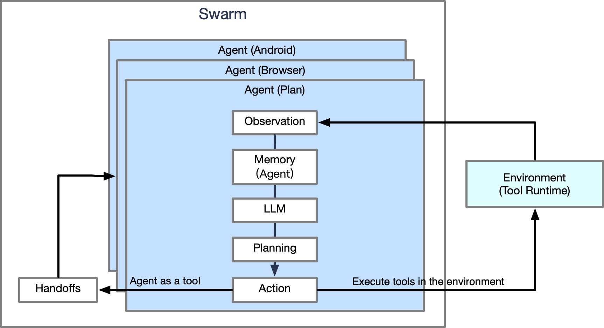

# AI Agents

Intelligent agents that control devices or tools in env using AI models or policy.



Most of the time, we directly use existing tools to build different types of agents that use LLM, 
using frameworks makes it easy to write various agents.

Detailed steps for building an agent:
1. Define your `Agent`
2. Write prompt used to the agent, also choose not to set it.
3. Run it.
    
We provide a complete and simple example for writing an agent and multi-agent:

```python
from aworld.config.conf import AgentConfig
from aworld.agents.llm_agent import Agent

prompt = """
Please act as a search agent, constructing appropriate keywords and searach terms, using search toolkit to collect relevant information, including urls, webpage snapshots, etc.
Here are some tips that help you perform web search:
- Never add too many keywords in your search query! Some detailed results need to perform browser interaction to get, not using search toolkit.
- If the question is complex, search results typically do not provide precise answers. It is not likely to find the answer directly using search toolkit only, the search query should be concise and focuses on finding official sources rather than direct answers.
  For example, as for the question "What is the maximum length in meters of #9 in the first National Geographic short on YouTube that was ever released according to the Monterey Bay Aquarium website?", your first search term must be coarse-grained like "National Geographic YouTube" to find the youtube website first, and then try other fine-grained search terms step-by-step to find more urls.
- The results you return do not have to directly answer the original question, you only need to collect relevant information.

Here are the question: {task}

Please perform web search and return the listed search result, including urls and necessary webpage snapshots, introductions, etc.
Your output should be like the followings (at most 3 relevant pages from coa):
[
    {{
        "url": [URL],
        "information": [INFORMATION OR CONTENT]
    }},
    ...
]
"""

# Step1
agent_config = AgentConfig(
    llm_provider="openai",
    llm_model_name="gpt-4o",
    llm_temperature=1,
    # need to set llm_api_key for use LLM
    llm_api_key=""
)

search = Agent(
    conf=agent_config,
    name="search_agent",
    system_prompt="You are a helpful search agent.",
    # used to opt the result, also choose not to set it
    agent_prompt=prompt,
    tool_names=["search_api"]
)

```

It can also quickly develop multi-agent based on the framework.

On the basis of the above agent(SearchAgent), we provide a multi-agent example:

```python
from aworld.agents.llm_agent import Agent

summary_prompt = """
Summarize the following text in one clear and concise paragraph, capturing the key ideas without missing critical points. 
Ensure the summary is easy to understand and avoids excessive detail.

Here are the content: 
{task}
"""

summary = Agent(
    conf=agent_config,
    name="summary_agent",
    system_prompt="You are a helpful general summary agent.",
    # used to opt the result, also choose not to set it
    agent_prompt=summary_prompt
)
```

You can run single-agent or multi-agent through Swarm.
NOTE: Need to set some environment variables first! Effective GOOGLE_API_KEY, GOOGLE_ENGINE_ID, OPENAI_API_KEY and OPENAI_ENDPOINT.

```python

from aworld.core.agent.swarm import Swarm
from aworld.runner import Runners

if __name__ == '__main__':
    task = "search 1+1=?"
    # build topology graph, the correct order is necessary
    swarm = Swarm(search, summary, max_steps=1)

    prefix = ""
    # can special search google, wiki, duck go, or baidu. such as:
    # prefix = "search wiki: "
    res = Runners.sync_run(
        input=prefix + """What is an agent.""",
        swarm=swarm
    )
```
You can view search example [code](../../examples/multi_agents/workflow/search).