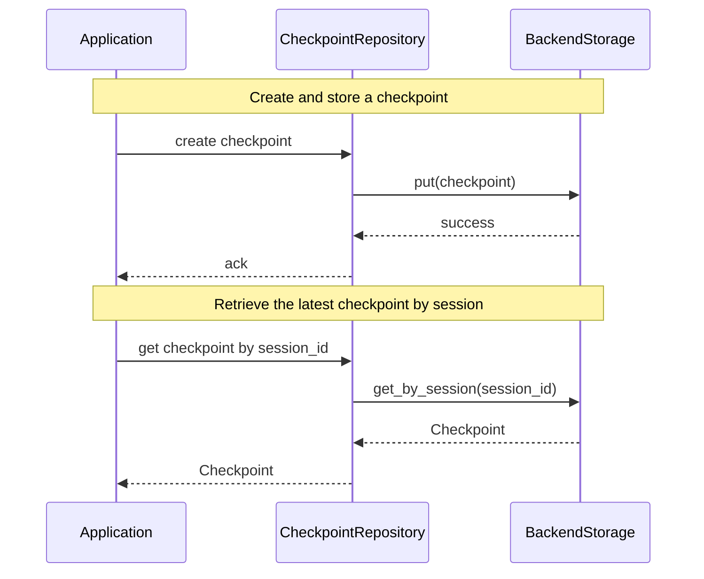
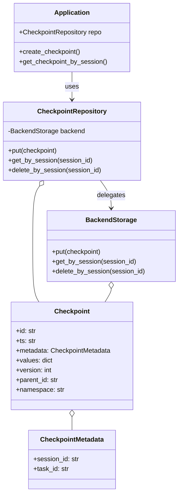

# Checkpoint Module

## Overview
The Checkpoint module provides a robust and extensible framework for managing state snapshots (checkpoints) in Python applications. It is designed for scenarios where you need to persist, restore, and version the state of a process, session, or task.



## Key Features

- **Structured Data Model**: Uses Pydantic's `BaseModel` for strong typing and validation of checkpoint data and metadata.
- **Versioning Support**: Built-in version management utilities for checkpoint evolution and comparison.
- **Extensible Repository Pattern**: Abstract base class (`BaseCheckpointRepository`) defines a standard interface for checkpoint storage, supporting both synchronous and asynchronous operations.
- **In-Memory Implementation**: Includes a simple, ready-to-use in-memory repository for development and testing.
- **Utility Functions**: Helper methods for creating, copying, and managing checkpoints.

## Data Structures




## Usage Example

```python
from aworld.checkpoint import (
    Checkpoint, CheckpointMetadata, empty_checkpoint, create_checkpoint, InMemoryCheckpointRepository
)

# Create a new checkpoint
metadata = CheckpointMetadata(session_id="session-123", task_id="task-456")
values = {"step": 1, "score": 100}
checkpoint = create_checkpoint(values=values, metadata=metadata)

# Store and retrieve using the in-memory repository
repo = InMemoryCheckpointRepository()
repo.put(checkpoint)
restored = repo.get(checkpoint.id)
```

## Extensibility
- Implement custom repositories by inheriting from `BaseCheckpointRepository` (e.g., for database, file, or cloud storage).
- Extend versioning logic via the `VersionUtils` class.
