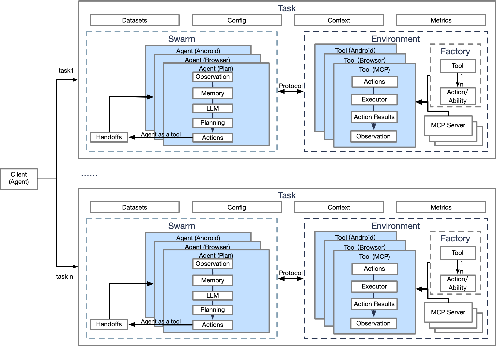

# Core Components

Common functionality and system components.

- `agent/`: Base agent for sub agents and description of already registered agents.
- `envs/`: The environment and its tools, as well as the related actions of the tools. It is a three-level and one to
  many structure.
- `swarm`: Interactive collaboration in the topology structure of multiple agents that interact with the environment tools. It can be
  considered as a multi-agent workflow.
- `task`: Complete runnable specific work that includes datasets, agents, environment, metrics, etc.
- `client`: Submit various tasks for execution and obtain results.

