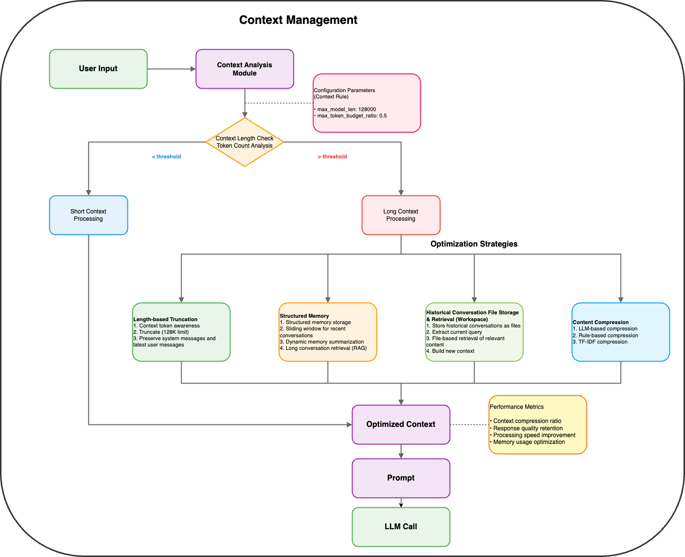

# AWorld Agent Context

Core context management system in the AWorld architecture for storing and managing complete Agent state information, including configuration data and runtime state.

## Architecture Overview



The Context Management system implements intelligent context processing with multiple optimization strategies based on context length analysis and configuration parameters.

## Features

- Complete Agent state management with support for state restoration and recovery
- Immutable configuration management and mutable runtime state tracking
- Intelligent LLM Prompt management and context optimization
- Complete LLM call intervention and control mechanisms
- Hook system support for extensible processing workflows
- Content compression and context window management

## Core Components

- `AgentContext`: Unified management container for Agent state and configuration
- `ContextProcessor`: Intelligent context processor supporting content compression and truncate
- `Hook System`: Extensible hook system supporting full-process LLM call intervention

## Basic Usage

### Using Default Context Configuration (Recommended)

```python
from aworld.core.agent.llm_agent import Agent
from aworld.config.conf import AgentConfig

# No need to explicitly configure context_rule, system automatically uses default configuration
agent = Agent(
    conf=AgentConfig(
        llm_model_name="gpt-4",
        llm_base_url="https://api.openai.com/v1",
        llm_api_key="your-api-key"
    ),
    name="my_agent"
)

# Default configuration is equivalent to:
# context_rule=ContextRuleConfig(
#     optimization_config=OptimizationConfig(
#         enabled=True,
#         max_token_budget_ratio=1.0  # Use 100% of context window
#     ),
#     llm_compression_config=LlmCompressionConfig(
#         enabled=False  # Compression disabled by default
#     )
# )

# Start conversation, AgentContext automatically manages state
messages = [
    {"role": "user", "content": "Explain what machine learning is"}
]

response = agent.run(messages)
print(f"Response: {response.content}")
print(f"Context Step: {agent.context.step}")  # Access runtime state
```

### Custom Context Configuration

```python
from aworld.config.conf import AgentConfig, ContextRuleConfig, OptimizationConfig, LlmCompressionConfig

# Create custom context rules
context_rule = ContextRuleConfig(
    optimization_config=OptimizationConfig(
        enabled=True,
        max_token_budget_ratio=0.8  # Use 80% of context window
    ),
    llm_compression_config=LlmCompressionConfig(
        enabled=True,  # Enable beta compression feature
        trigger_compress_token_length=8000,
        trigger_mapreduce_compress_token_length=50000
    )
)

# Create Agent using custom context rules
agent = Agent(
    conf=AgentConfig(
        llm_model_name="gpt-4",
        llm_api_key="your_api_key",
        context_rule=context_rule
    ),
    name="optimized_agent",
    system_prompt="You are an AI assistant with optimized context management."
)

# AgentContext will automatically optimize context according to rules
response = agent.run("Tell me about the history of artificial intelligence.")
print(response.content)
```

### State Management and Recovery

```python
# AgentContext supports complete state management and modification
agent = Agent(conf=config, name="stateful_agent")

# Access initial AgentContext state
print(f"Initial Agent ID: {agent.agent_context.agent_id}")
print(f"Initial System Prompt: {agent.agent_context.system_prompt}")
print(f"Initial Step: {agent.agent_context.step}")

# Execute first conversation
agent.run("What is Python?")

# Modify system prompt through agent_context
new_system_prompt = "You are a Python expert who provides detailed and practical answers."
agent.update_system_prompt(new_system_prompt)
print(f"Updated System Prompt: {agent.agent_context.system_prompt}")

# Execute more conversations
agent.run("How do I install Python packages?")
agent.run("Show me a simple example.")

# Access comprehensive AgentContext information
print(f"\n=== AgentContext State Information ===")
print(f"Agent ID: {agent.agent_context.agent_id}")
print(f"Agent Name: {agent.agent_context.agent_name}")
print(f"Current Step: {agent.agent_context.step}")
print(f"Message Count: {len(agent.agent_context.messages)}")
print(f"Tool Names: {agent.agent_context.tool_names}")
print(f"Model Config: {agent.agent_context.model_config}")

# Get context usage statistics
context_usage = agent.agent_context.context_usage
if context_usage:
    print(f"\n=== Context Usage Statistics ===")
    print(f"Total Context Length: {context_usage.total_context_length}")
    print(f"Used Context Length: {context_usage.used_context_length}")
    print(f"Usage Ratio: {agent.agent_context.get_context_usage_ratio():.2%}")

# Modify context configuration if needed
from aworld.config.conf import ContextRuleConfig, OptimizationConfig
new_context_rule = ContextRuleConfig(
    optimization_config=OptimizationConfig(
        enabled=True,
        max_token_budget_ratio=0.8
    )
)
agent.update_context_rule(new_context_rule)
print(f"Updated Context Rule: {agent.agent_context.context_rule}")
```

### Hook System and LLM Call Intervention

```python
import abc
from aworld.core.agent.llm_agent import Agent
from aworld.core.context.base import AgentContext, Context
from aworld.core.event.base import Message
from aworld.runners.hook.hooks import PreLLMCallHook, PostLLMCallHook, HookPoint
from aworld.runners.hook.hook_factory import HookFactory
from aworld.utils.common import convert_to_snake

# Define custom Pre-LLM call hook
@HookFactory.register(name="CustomPreLLMHook", desc="Custom pre-LLM processing hook")
class CustomPreLLMHook(PreLLMCallHook):
    """Custom pre-processing hook before LLM call"""
    
    def name(self):
        return convert_to_snake("CustomPreLLMHook")
    
    async def exec(self, message: Message, agent_context: AgentContext = None, context: Context = None) -> Message:
        """Execute pre-LLM hook logic"""
        print(f"[Pre-LLM Hook] Agent: {agent_context.agent_name}, Step: {agent_context.step}")
        print(f"[Pre-LLM Hook] Processing {len(agent_context.messages)} messages")
        
        # Can modify agent context here
        # For example, add custom system prompt
        if len(agent_context.messages) > 5:
            print("[Pre-LLM Hook] Long conversation detected, optimizing context...")
        
        return message

# Define custom Post-LLM call hook  
@HookFactory.register(name="CustomPostLLMHook", desc="Custom post-LLM processing hook")
class CustomPostLLMHook(PostLLMCallHook):
    """Custom post-processing hook after LLM call"""
    
    def name(self):
        return convert_to_snake("CustomPostLLMHook")
    
    async def exec(self, message: Message, agent_context: AgentContext = None, context: Context = None) -> Message:
        """Execute post-LLM hook logic"""
        print(f"[Post-LLM Hook] Agent: {agent_context.agent_name} completed step {agent_context.step}")
        
        # Access and log context usage
        if agent_context.context_usage:
            usage_ratio = agent_context.get_context_usage_ratio()
            print(f"[Post-LLM Hook] Context usage: {usage_ratio:.2%}")
            
            # Alert if context usage is high
            if usage_ratio > 0.8:
                print("[Post-LLM Hook] ⚠️ High context usage detected!")
        
        return message

# Example: Logging and monitoring hook
@HookFactory.register(name="LoggingMonitorHook", desc="Logging and monitoring hook")
class LoggingMonitorHook(PreLLMCallHook):
    """Hook for logging and monitoring LLM calls"""
    
    def name(self):
        return convert_to_snake("LoggingMonitorHook")
    
    async def exec(self, message: Message, agent_context: AgentContext = None, context: Context = None) -> Message:
        """Log LLM call information"""
        # Log agent state
        print(f"🔍 [Monitor] Agent: {agent_context.agent_name}")
        print(f"📊 [Monitor] Step: {agent_context.step}")
        print(f"💬 [Monitor] Messages count: {len(agent_context.messages)}")
        print(f"🛠️ [Monitor] Available tools: {agent_context.tool_names}")
        
        # Log latest user message
        if agent_context.messages:
            latest_msg = agent_context.messages[-1]
            if latest_msg.get("role") == "user":
                content = latest_msg.get("content", "")
                print(f"👤 [Monitor] User input: {content[:100]}...")
        
        return message

# Create Agent and use hooks
from aworld.config.conf import AgentConfig

agent = Agent(
    conf=AgentConfig(
        llm_model_name="gpt-4",
        llm_api_key="your_api_key"
    ),
    name="hooked_agent",
    system_prompt="You are a helpful assistant with hook-based monitoring."
)

# Hooks are automatically registered and executed during LLM calls
# The hooks will be triggered at appropriate hook points during agent execution

# Execute conversation - hooks will be automatically triggered
response = agent.run("Search for Python tutorials and summarize them.")
```

## Context Object

Context is a singleton object that enables state sharing and coordination between multiple Agents in the AWorld framework.

### Key Features

- **Singleton Pattern**: Ensures a single shared context instance across the entire application
- **Dictionary Interface**: Supports simple key-value state storage using `context['key'] = value` syntax  
- **Multi-Agent Coordination**: Enables seamless data exchange between different Agents

### Multi-Agent State Sharing

```python
# Agent 1 stores information
context['data_collected'] = True
context['last_update'] = time.time()

# Agent 2 can immediately access the shared state
if context.get('data_collected'):
    context['processing_started'] = time.time()
    print(f"Processing started by Agent 2 at {context['processing_started']}")

# Agent 3 continues the workflow
context['workflow_step'] = 'analysis'
context['completion_progress'] = 0.75
```

## AgentContext Object

AgentContext is the core object for state management, containing the following key attributes:

### Immutable Configuration Fields
- `agent_id`: Agent unique identifier
- `agent_name`: Agent name
- `agent_desc`: Agent description
- `system_prompt`: System prompt
- `agent_prompt`: Agent-specific prompt
- `tool_names`: Tool name list
- `context_rule`: Context processing rules

### Mutable Runtime Fields
- `tools`: Tool object list
- `step`: Current execution step
- `messages`: Conversation message history
- `context_usage`: Context usage statistics

Example:
```python
agent = Agent(conf=config, name="example_agent")

# Access immutable configuration
print(f"Agent ID: {agent.context.agent_id}")
print(f"System Prompt: {agent.context.system_prompt}")
print(f"Tool Names: {agent.context.tool_names}")

# Access runtime state
print(f"Current Step: {agent.context.step}")
print(f"Message History: {len(agent.context.messages)}")
print(f"Available Tools: {len(agent.context.tools)}")
```

## Context Rule Configuration

`ContextRuleConfig` provides comprehensive context management through two main configuration components:

### OptimizationConfig

Controls context optimization behavior:

- `enabled`: Whether to enable context optimization (default: `False`)
- `max_token_budget_ratio`: Maximum token budget ratio for context window usage (default: `0.5`, range: 0.0-1.0)

### LlmCompressionConfig (Beta Feature)

**⚠️ Beta Feature**: This configuration is currently in beta and may undergo changes in future versions.

Controls intelligent context compression:

- `enabled`: Whether to enable LLM-based compression (default: `False`)
- `trigger_compress_token_length`: Token threshold to trigger basic compression (default: `10000`)
- `trigger_mapreduce_compress_token_length`: Token threshold to trigger map-reduce compression (default: `100000`)
- `compress_model`: ModelConfig for compression LLM calls (optional)

### Configuration Examples

```python
from aworld.config.conf import ContextRuleConfig, OptimizationConfig, LlmCompressionConfig

# Basic optimization only
basic_context_rule = ContextRuleConfig(
    optimization_config=OptimizationConfig(
        enabled=True,
        max_token_budget_ratio=0.8  # Use 80% of context window
    )
)

# Advanced configuration with compression (Beta)
advanced_context_rule = ContextRuleConfig(
    optimization_config=OptimizationConfig(
        enabled=True,
        max_token_budget_ratio=0.6
    ),
    llm_compression_config=LlmCompressionConfig(
        enabled=True,  # Enable beta compression feature
        trigger_compress_token_length=8000,
        trigger_mapreduce_compress_token_length=50000
    )
)

# Conservative configuration for production
production_context_rule = ContextRuleConfig(
    optimization_config=OptimizationConfig(
        enabled=True,
        max_token_budget_ratio=0.7
    ),
    llm_compression_config=LlmCompressionConfig(
        enabled=False  # Disable beta features for stability
    )
)
```

## Notes

1. **Beta Features**: The `llm_compression_config` is currently in beta. Use with caution in production environments.
2. **Performance Trade-offs**: Enabling compression can save token usage but increases processing time. Adjust configuration based on actual needs.
3. **Model Compatibility**: Different models have different context length limitations. The system automatically adapts to model capabilities.
4. **Default Configuration**: The system provides reasonable default configuration. Manual configuration is unnecessary for most scenarios.
5. **State Management**: AgentContext supports state sharing between multiple Agents and ensures state consistency. State persistence functionality is currently under development.

Through proper configuration of AgentContext and context processors, you can significantly improve Agent performance in long conversations and complex tasks while optimizing token usage efficiency.