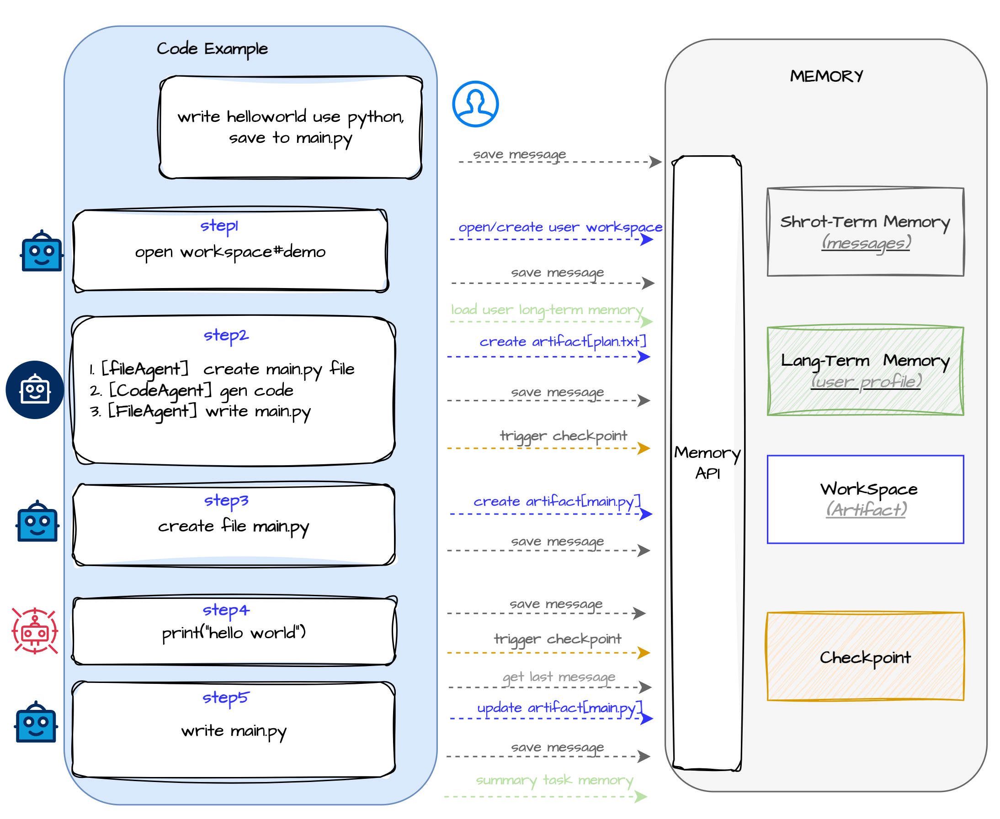

## multi-agents memory


### Short-Term Memory
TODO

### Long-Term Memory
TODO

### WorkSpace
WorkSpace is a container for managing related artifacts, providing version control, collaborative editing, and persistent storage capabilities.

Each workspace can contain multiple types of artifacts (text, code, JSON, etc.), with each artifact having its own version history. Workspaces provide persistence through a content-addressable storage system, supporting workspace saving and loading.


Key features of workspaces:
- Support for creating and managing multiple types of artifacts
- Complete version history for each artifact
- Content-addressable persistent storage
- Observer pattern for change notifications
- Artifacts are archived rather than physically deleted, allowing for recovery

Below is a basic example of workspace usage:

```python
from aworld.output.artifact import ArtifactType
from aworld.output.workspace import WorkSpace

# Create workspace
workspace = WorkSpace(name="Example Workspace")

# Create different types of artifacts
text_artifact = workspace.create_artifact(
    artifact_type=ArtifactType.TEXT,
    content="This is a simple text artifact.",
    metadata={"description": "Demo text artifact"}
)

code_artifact = workspace.create_artifact(
    artifact_type=ArtifactType.CODE,
    content="def hello_world():\n    print('Hello, World!')",
    metadata={"language": "python"}
)

# Update artifact content
workspace.update_artifact(
    artifact_id=code_artifact.artifact_id,
    content="def hello_world():\n    print('Hello, World!')\n\ndef goodbye():\n    print('Goodbye!')",
    description="Added goodbye function"
)

# Save workspace
workspace_version_id = workspace.save()

# Load workspace
loaded_workspace = WorkSpace.load(workspace.workspace_id)
```

For a more comprehensive example, refer to `examples/workspace_demo.py`.

### CheckPoint
TODO