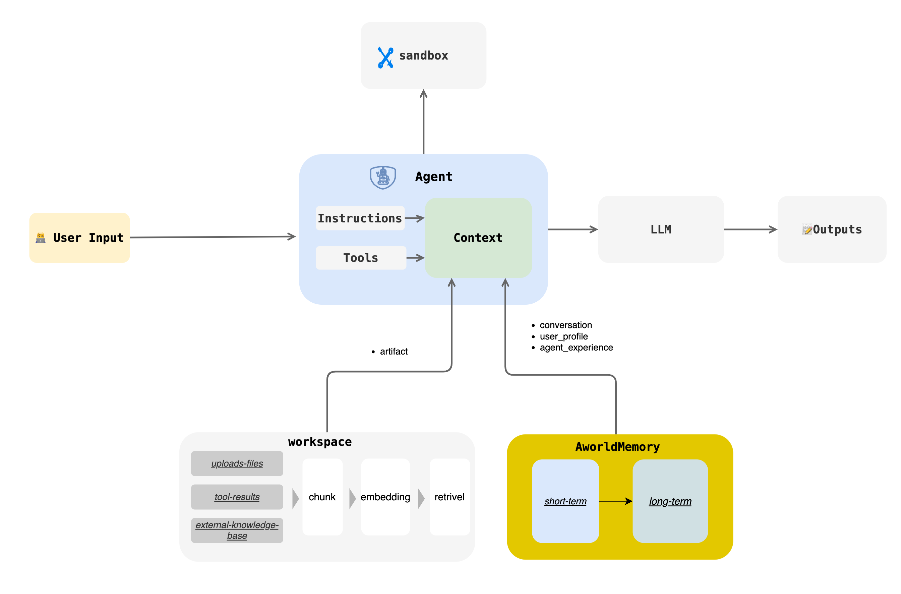

# Memory



## Introduction

The Aworld Memory module provides a unified memory management mechanism for multi-agent systems. It is designed to enable agents to store, retrieve, and process information, thereby facilitating continuous learning and personalized interactions. The module supports both short-term and long-term memory and offers flexible configuration options to suit various application scenarios.

Key features include:
- **Short-Term Memory**: For quick access to recent interaction content, with various summarization strategies to control context length.
- **Long-Term Memory**: Persistently stores key information through structured `UserProfile` and `AgentExperience` models, enabling agents to learn and grow across sessions.
- **Flexible Backend Support**: Supports various vector databases and data storage backends, such as ChromaDB and PostgreSQL.
- **Customizable Configuration**: Provides detailed configuration options, allowing developers to tailor memory behavior to their needs.

---

## Core Concepts

### Short-Term Memory

Short-term memory is used to store immediate interaction records, such as `User2Agent`, `Agent2Agent`, and interactions between an `Agent` and `LLM/Tool`. It centrally stores all messages through a unified `MemoryStore` (e.g., `InMemoryMemoryStore`) and provides the `get_last_n(last_rounds)` method to quickly retrieve the latest N messages.

#### Summarization Strategy

To optimize performance and manage context length, the system includes several automatic summarization strategies:

| Strategy | Description | Configuration |
| --- | --- | --- |
| Trimming Strategy | Keeps only the most recent `N` rounds of conversation. | `trim_rounds=100` (default) |
| Fixed Step Summary | Creates a summary every `N` messages, retaining only the summary. | `enable_summary=true`<br/>`summary_rounds=5` |
| Fixed Context Length Summary | Compresses the conversation history when the total length of unsaved messages exceeds a threshold. | `enable_summary=true`<br/>`summary_context_length=10000` |
| Current Round Summary | Compresses the current conversation when the length of the latest message exceeds a threshold. | `enable_summary=true`<br/>`summary_single_context_length=10000` |

### Long-Term Memory

Long-term memory enables continuous learning and personalized interactions through two main types: `UserProfile` and `AgentExperience`.

#### UserProfile

`UserProfile` systematically captures and stores user information, preferences, and behavioral patterns in a `key-value` structure to build a detailed user profile.

```python
class UserProfileItem(BaseModel):
    key: str = Field(description="The key of the profile")
    value: Any = Field(description="The value of the profile")

class UserProfile(MemoryItem):
    """
    Represents a user profile key-value pair.
    """
    def __init__(self, user_id: str, key: str, value: Any, metadata: Optional[Dict[str, Any]] = None) -> None:
        meta = metadata.copy() if metadata else {}
        meta['user_id'] = user_id
        user_profile = UserProfileItem(key=key, value=value)
        super().__init__(content=user_profile, metadata=meta, memory_type="user_profile")
```

#### AgentExperience

`AgentExperience` focuses on capturing the skills and action sequences an AI agent acquires during task execution. It records problem-solving patterns in a `skill-actions` structure, allowing the agent to learn from past experiences and improve future performance.

```python
class AgentExperienceItem(BaseModel):
    skill: str = Field(description="The skill demonstrated in the experience")
    actions: List[str] = Field(description="The actions taken by the agent")


class AgentExperience(MemoryItem):
    """
    Represents an agent's experience, including skills and actions.
    """
    def __init__(self, agent_id: str, skill: str, actions: List[str], metadata: Optional[Dict[str, Any]] = None) -> None:
        meta = metadata.copy() if metadata else {}
        meta['agent_id'] = agent_id
        agent_experience = AgentExperienceItem(skill=skill, actions=actions)
        super().__init__(content=agent_experience, metadata=meta, memory_type="agent_experience")
```

---

## API Reference

Core interactions with the Memory module are defined by the `MemoryBase` abstract class, which provides a unified interface for memory operations.

```python
from aworld.core.memory import MemoryBase, MemoryItem, AgentMemoryConfig
from aworld.memory.models import UserProfile, AgentExperience, LongTermMemoryTriggerParams

class MemoryBase(ABC):

    @abstractmethod
    def get(self, memory_id) -> Optional[MemoryItem]: ...

    @abstractmethod
    def get_all(self, filters: dict = None) -> Optional[list[MemoryItem]]: ...

    @abstractmethod
    def get_last_n(self, last_rounds, ...) -> Optional[list[MemoryItem]]: ...

    @abstractmethod
    async def add(self, memory_item: MemoryItem, ...): ...

    @abstractmethod
    def search(self, query, ...) -> Optional[list[MemoryItem]]: ...

    @abstractmethod
    async def trigger_short_term_memory_to_long_term(self, params: LongTermMemoryTriggerParams, ...): ...
    
    @abstractmethod
    async def retrival_user_profile(self, user_id: str, user_input: str, ...) -> Optional[list[UserProfile]]: ...

    @abstractmethod
    async def retrival_agent_experience(self, agent_id: str, user_input: str, ...) -> Optional[list[AgentExperience]]: ...

    @abstractmethod
    def update(self, memory_item: MemoryItem): ...

    @abstractmethod
    def delete(self, memory_id): ...
```

---

## Usage Examples

### Initializing Memory

It is recommended to use `MemoryFactory` to initialize and access Memory instances.

```python
from aworld.memory.main import MemoryFactory
from aworld.core.memory import MemoryConfig, MemoryLLMConfig

# Simple initialization
memory = MemoryFactory.instance()

# Initialization with LLM configuration
MemoryFactory.init(
    config=MemoryConfig(
        provider="aworld",
        llm_config=MemoryLLMConfig(
            provider="openai",
            model_name=os.environ["LLM_MODEL_NAME"],
            api_key=os.environ["LLM_API_KEY"],
            base_url=os.environ["LLM_BASE_URL"]
        )
    )
)
memory = MemoryFactory.instance()
```

### Using Short-Term Memory

The following example demonstrates how to use different message types (`MemorySystemMessage`, `MemoryHumanMessage`, `MemoryAIMessage`, `MemoryToolMessage`) to construct a conversation and store it in short-term memory.

```python
import os
from aworld.memory.main import MemoryFactory
from aworld.memory.models import (
    MemorySystemMessage,
    MemoryHumanMessage,
    MemoryAIMessage,
    MemoryToolMessage,
    MessageMetadata,
)
from aworld.models.model_response import ToolCall
from aworld.core.memory import MemoryConfig

# Example setup: Initialize MemoryFactory if not already done.
# This is usually done once at application startup.
if not MemoryFactory.is_initialized():
    # A default configuration for demonstration purposes.
    # In a real application, you would configure this properly.
    MemoryFactory.init(
        config=MemoryConfig(provider="aworld")
    )

# 1. Get a Memory instance
memory = MemoryFactory.instance()

# 2. Define common metadata for the conversation
metadata = MessageMetadata(
    user_id="user-123",
    session_id="session-abc",
    task_id="task-xyz",
    agent_id="agent-007",
    agent_name="ToolAgent"
)

# 3. Create and add different types of messages to build a conversation flow

# System message to set the agent's context
system_message = MemorySystemMessage(
    content="You are a helpful assistant that can access tools.",
    metadata=metadata
)
memory.add(system_message)

# User's message (Human)
human_message = MemoryHumanMessage(
    content="What's the weather like in London and what is 2+2?",
    metadata=metadata
)
memory.add(human_message)

# AI's response indicating it will use tools
ai_message = MemoryAIMessage(
    content="I can help with that. I'll use my tools to get the weather and perform the calculation.",
    tool_calls=[
        ToolCall(id="call_weather_1", function_name="get_weather", function_arguments='{"city": "London"}'),
        ToolCall(id="call_calc_2", function_name="calculator", function_arguments='{"expression": "2+2"}')
    ],
    metadata=metadata
)
memory.add(ai_message)

# Results from the tool calls
tool_message_1 = MemoryToolMessage(
    tool_call_id="call_weather_1",
    content='{"temperature": "15°C", "condition": "Cloudy"}',
    status="success",
    metadata=metadata
)
memory.add(tool_message_1)

tool_message_2 = MemoryToolMessage(
    tool_call_id="call_calc_2",
    content='{"result": 4}',
    status="success",
    metadata=metadata
)
memory.add(tool_message_2)

# 4. Retrieve the conversation history
# The memory store is currently in-memory, so we can retrieve all items.
conversation_history = memory.get_all(filters={"session_id": "session-abc"})

print("--- Conversation History ---")
for msg in conversation_history:
    print(f"Role: {msg.role}, Content: {msg.content}")
    if isinstance(msg, MemoryAIMessage) and msg.tool_calls:
        for tc in msg.tool_calls:
            print(f"  -> Tool Call: {tc.function_name}({tc.function_arguments})")
```

### Advanced Configuration

`MemoryConfig` allows you to integrate different embedding models and vector databases.

#### Using Custom Embedding and VectorDB

```python
from aworld.core.memory import MemoryConfig, MemoryLLMConfig, EmbeddingsConfig, VectorDBConfig

MemoryFactory.init(
    config=MemoryConfig(
        provider="aworld",
        llm_config=MemoryLLMConfig(
            provider="openai",
            model_name=os.environ["LLM_MODEL_NAME"],
            api_key=os.environ["LLM_API_KEY"],
            base_url=os.environ["LLM_BASE_URL"]
        ),
        embedding_config=EmbeddingsConfig(
            provider="ollama", # or huggingface, openai, etc.
            base_url="http://localhost:11434",
            model_name="nomic-embed-text"
        ),
        vector_store_config=VectorDBConfig(
            provider="chroma",
            config={
                "chroma_data_path": "./chroma_db",
                "collection_name": "aworld",
            }
        )
    )
)
```

#### Using PostgreSQL as a Backend

```python
from aworld.memory.db import PostgresMemoryStore

# Initialize the PostgreSQL store
postgres_memory_store = PostgresMemoryStore(db_url=os.getenv("MEMORY_STORE_POSTGRES_DSN"))

# Pass the custom memory store during Factory initialization
MemoryFactory.init(
    custom_memory_store=postgres_memory_store,
    config=MemoryConfig(
        # ... other configurations
    )
)
```

### Agent Memory Configuration

You can fine-tune an agent's memory behavior using `AgentMemoryConfig`. After defining the configuration, pass it to the `Agent` instance during initialization.

```python
import os
from aworld.agents.llm_agent import Agent
from aworld.config import AgentConfig
from aworld.core.memory import AgentMemoryConfig, LongTermConfig

# 1. Define the AgentMemoryConfig
agent_memory_config = AgentMemoryConfig(
    # Enable short-term memory summarization
    enable_summary=True,
    summary_rounds=5,
    summary_context_length=8000,
    
    # Keep the last 20 rounds of conversation
    trim_rounds=20,

    # Enable long-term memory to store user profiles and agent experiences
    enable_long_term=True,
    long_term_config=LongTermConfig.create_simple_config(
        application_id="my-awesome-app",
        enable_user_profiles=True,
        enable_agent_experiences=True
    )
)

# 2. Define the agent's main configuration using AgentConfig
# (Ensure your environment variables for the LLM are set)
agent_conf = AgentConfig(
    llm_provider="openai",
    llm_model_name=os.environ.get("LLM_MODEL_NAME", "gpt-4"),
    llm_api_key=os.environ.get("LLM_API_KEY"),
    llm_base_url=os.environ.get("LLM_BASE_URL")
)

# 3. Initialize the Agent, passing the memory configuration
my_memory_agent = Agent(
    conf=agent_conf,
    name="MyMemoryAgent",
    system_prompt="You are an agent with advanced memory capabilities.",
    agent_memory_config=agent_memory_config  # Pass the config here
)

# Now, `my_memory_agent` will use the specified memory settings when it runs.
# For example, it will automatically create summaries and extract long-term memories.
```