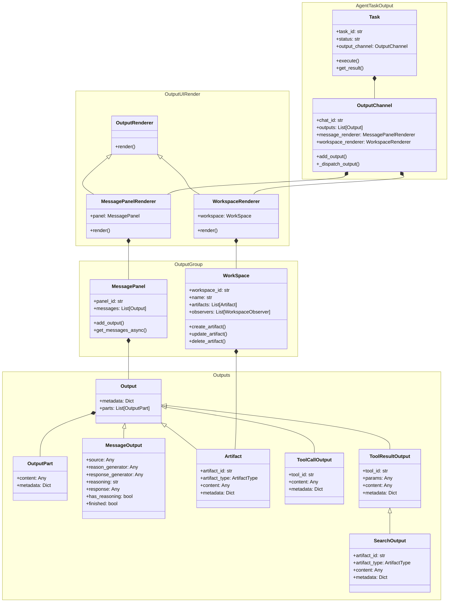

# AWorld Output Module

The Output module is a flexible and extensible system for managing outputs and artifacts in the AWorld framework.

## Key Features

- **Output Channel Management**: Centralized output handling through `OutputChannel`
- **Multiple Output Types Support**: 
  - Message outputs for text-based communication
  - Artifact outputs for files and code
  - Workspace outputs for managing collections of artifacts
- **Rendering System**: Flexible rendering system with different renderers for various output types
- **Workspace Management**: 
  - Version control for artifacts
  - Local storage support
  - Observer pattern for real-time updates
- **Artifact Management**:
  - Support for different artifact types (Code, Message, etc.)
  - Metadata handling
  - Content versioning

## Class Diagram



## OutputChannel Example

```python

```

## Workspace Example
see
[run.py](../../examples/output/workspace/run.py)