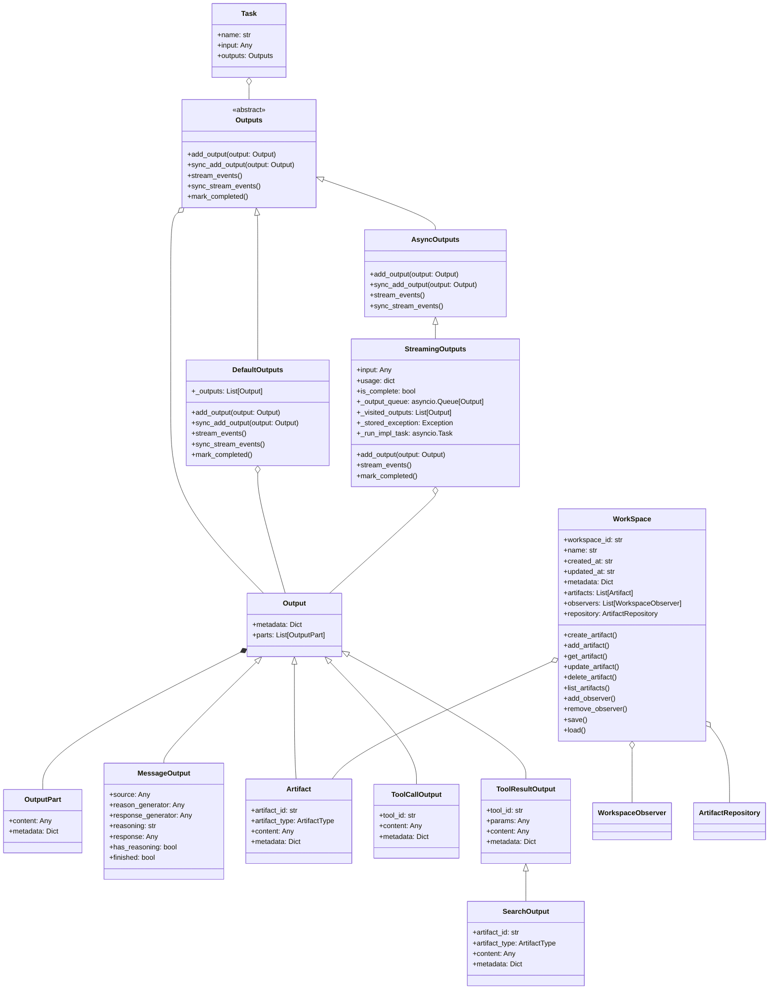

# AWorld Output Module

The Output module is a flexible and extensible system for managing outputs and artifacts in the AWorld framework.

## Key Features

- **Unified Output Management**: Centralized management of all output types (messages, artifacts, tool results, etc.) through a flexible Outputs interface.
- **Support for Multiple Output Types**: Handles text, code, files, tool calls, and custom outputs, enabling rich interaction and extensibility.
- **Async & Sync Streaming**: Provides both asynchronous and synchronous streaming of outputs, supporting real-time and batch processing scenarios.
- **Output Aggregation & Dispatch**: Aggregates outputs from various sources and dispatches them to different consumers or UIs.
- **Extensible Output Channels**: Easily extendable output channels and renderers for custom UI or integration needs.
- **Integration with Task & Workspace**: Seamlessly integrates with Task and WorkSpace modules for collaborative, versioned, and observable output management.
- **Real-time, Batch, and Streaming Modes**: Supports real-time, batch, and streaming output modes for flexible workflow requirements.
- **Observer Pattern Support**: Built-in observer pattern for real-time updates and notifications on output or artifact changes.
- **Easy Customization**: Designed for easy extension and customization to fit various application scenarios.
- **Rich UI Rendering**: Supports diverse output rendering with pluggable UI renderers for CLI, web, and custom frontends.
- **Decoupled UI & Output Types**: UI rendering is decoupled from output types, enabling flexible presentation and interaction.
- **Real-time Interactive Display**: Enables real-time, streaming, and interactive output display in various UI environments.
- **UI Extensibility**: Easy to extend and customize UI components to fit different user experiences and workflows.

## Class Diagram

