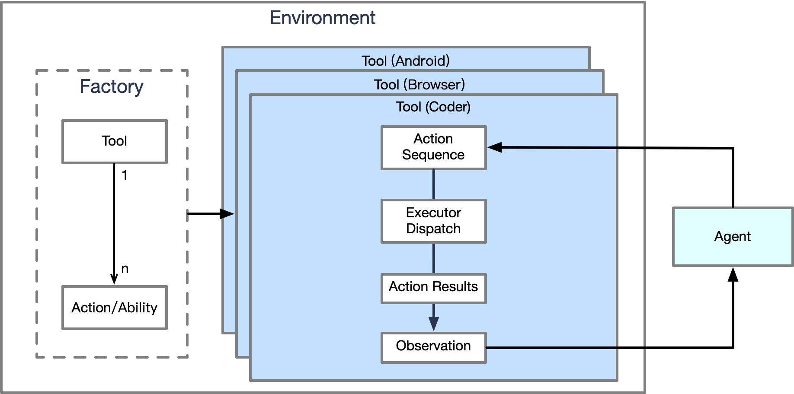

# Environments

Virtual environments for execution of various tools.

Running on the local, we assume that the virtual environment completes startup when the python application starts.



# Be tool

You also can convert locally defined functions into tools for use in a task.

NOTE: The function must have a return value, preferably a string, as observed content.

```python
from pydantic import Field

from aworld.core.tool.func_to_tool import be_tool


@be_tool(tool_name='example', tool_desc="example description")
def example_1() -> str:
    return "example_1"


@be_tool(tool_name='example')
def example_2(param: str) -> str:
    return f"example_2{param}"


@be_tool(tool_name='example', name="example_3_alias_name", desc="example_3 description")
def example_3(param_1: str = "param",
              param_2: str = Field(default="", description="param2 description")) -> str:
    return f"example_3{param_1}{param_2}"
```

The name of the tool is `example`, now, you can use these functions as tools in the framework.

# Write tool

Detailed steps for building a tool:

1. Register action of your tool to action factory, and inherit `ExecutableAction`
2. Optional implement the `act` or `async_act` method
3. Register your tool to tool factory, and inherit `Tool` or `AsyncTool`
4. Write the `step` method to execute the abilities in the tool and generate observation, update finished Status.

```python
from typing import List, Tuple, Dict, Any

from aworld.core.common import ActionModel, Observation
from aworld.core.tool.action import ExecutableAction
from aworld.core.tool.base import ActionFactory, ToolFactory, AgentInput
from aworld.tools.template_tool import TemplateTool

from examples.common.tools.tool_action import GymAction


@ToolFactory.register(name="openai_gym", desc="gym classic control game", supported_action=GymAction)
class OpenAIGym(TemplateTool):
    def step(self, action: List[ActionModel], **kwargs) -> Tuple[AgentInput, float, bool, bool, Dict[str, Any]]:
        ...
        state, reward, terminal, truncate, info = self.env.step(action)
        ...
        return (Observation(content=state),
                reward,
                terminal,
                truncate,
                info)


@ActionFactory.register(name=GymAction.PLAY.value.name,
                        desc=GymAction.PLAY.value.desc,
                        tool_name="openai_gym")
class Play(ExecutableAction):
    """There is only one Action, it can be implemented in the tool, registration is required here."""
```

You can view the example [code](gym_tool/openai_gym.py) to learn more.
