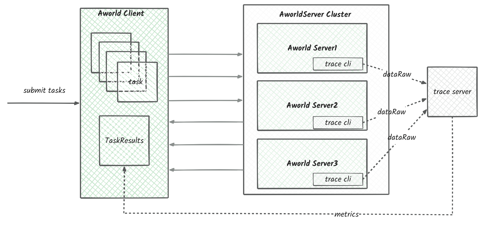

# AworldServer

AworldServer is an execution environment for the Aworld framework that integrates MCP LLM models. It supports distributed deployment and dynamic scaling. 



The system features:

- Distributed Architecture: Supports multi-server deployment with load balancing
- Dynamic Scaling: Ability to adjust server capacity based on demand
- LLM Integration: Built-in MCP LLM model support
- Asynchronous Processing: Uses asynchronous programming patterns for improved performance
- Containerized Deployment: Docker containerization support for easy environment management


## 🚀 Quick Start

1. Start services using Docker Compose:

```sh
docker build  --build-arg MINIMUM_BUILD=true -f Dockerfile  --progress=plain -t aworldserver:main .

docker compose up -d
```
2. Configure the number of server instances:

You can modify the `docker-compose.yaml` file to adjust the number of server instances. The default configuration includes 3 instances:

3. Usage Methods:

   a. OpenWebUI Integration:
   - Configure external link in OpenWebUI settings
   - Add AworldServer endpoints to the configuration
   - Set up API key authentication

   b. Python Client Usage:
   ```python
   # Initialize AworldTaskClient with server endpoints
   AWORLD_TASK_CLIENT = AworldTaskClient(
       know_hosts=["localhost:9299", "localhost:9399", "localhost:9499"]
   )

   async def _run_gaia_task(gaia_question_id: str) -> None:
       """Run a single Gaia task with the given question ID.
       
       Args:
           gaia_question_id: The ID of the question to process
       """
       global AWORLD_TASK_CLIENT
       task_id = str(uuid.uuid4())
       
       # Submit task to Aworld server
       await AWORLD_TASK_CLIENT.submit_task(
           AworldTask(
               task_id=task_id,
               agent_id="gaia_agent",
               agent_input=gaia_question_id,
               session_id="session_id",
               user_id="SYSTEM"
           )
       )
       
       # Get and print task result
       task_result = await AWORLD_TASK_CLIENT.get_task_state(task_id=task_id)
       print(task_result)

   async def _batch_run_gaia_task(start_i: int, end_i: int) -> None:
       """Run multiple Gaia tasks in parallel.
       
       Args:
           start_i: Starting question ID
           end_i: Ending question ID
       """
       tasks = [
           _run_gaia_task(str(i))
           for i in range(start_i, end_i + 1)
       ]
       await asyncio.gather(*tasks)

   if __name__ == '__main__':
       # Run batch processing for questions 1-5
       asyncio.run(_batch_run_gaia_task(1, 5))
   ```
   c. user curl
```shell
curl http://localhost:9299/v1/chat/completions \
  -H "Content-Type: application/json" \
  -H "Authorization: Bearer 0p3n-w3bu!" \
  -d '{
  "model": "gaia_agent",
  "messages": [
    {
      "role": "user",
      "content": [
        {
          "type": "text",
          "text": "5"
        }
      ]
    }
  ]
}'

```


## 🔑 Key Features

- **Distributed Task Processing System**
  - Multi-server load balancing
  - Round-robin task distribution
  - Asynchronous task processing

- **Docker Containerization**
  - Multi-instance deployment
  - Environment variable configuration
  - Auto-restart mechanism

- **API Services**
  - FastAPI framework support
  - RESTful API design
  - Asynchronous request handling

- **Development Tools**
  - Debug mode support
  - Batch task processing
  - Task state tracking

- **Security Features**
  - API key authentication
  - Session management
  - User authentication


## 📦 Installation and Setup

Get started with aworldserver in a few easy steps:

1. **Ensure Python 3.11 is installed.**

2. **Install the required dependencies:**

   ```sh
   pip install -r requirements-minimux.txt
   ```

3. **Start the aworld server:**

   ```sh
   sh ./start.sh
   ```
### Custom debug

please run `debug_run.py`

## 
